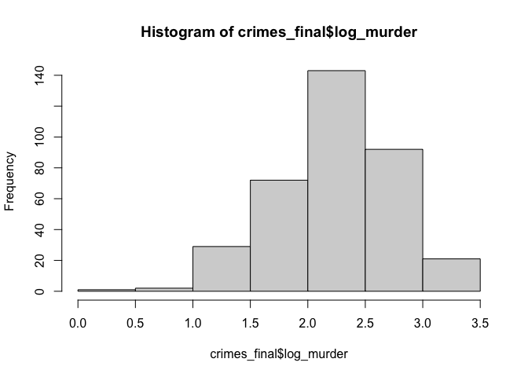
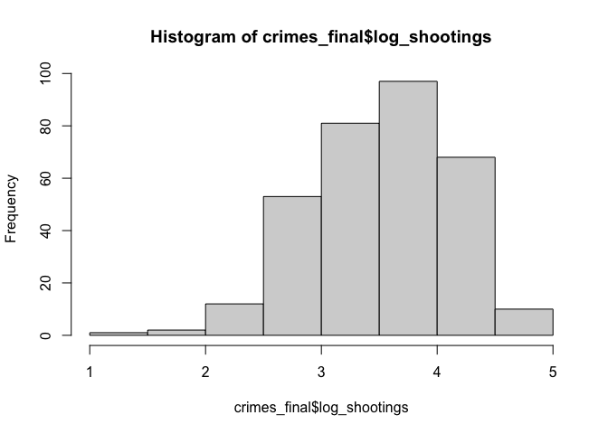
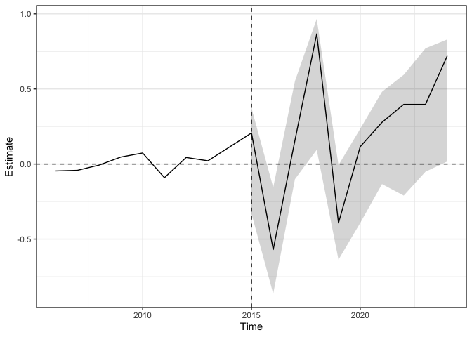
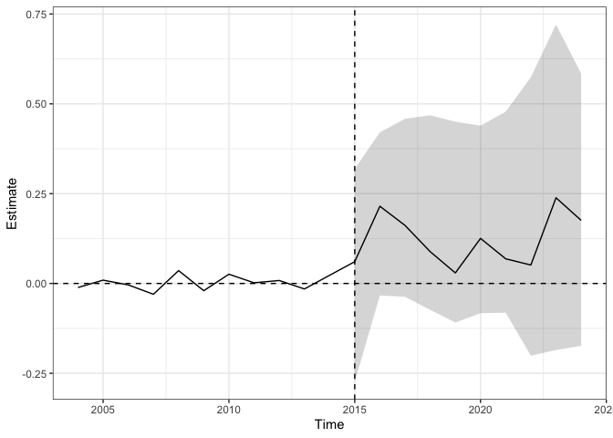
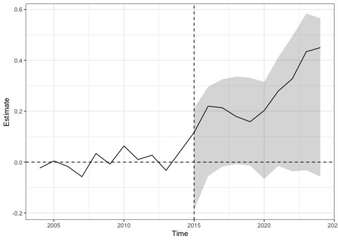

NYC Precinct Murder + Shootings + Crimes DiD + Augmented Synthetic
Control Analysis
================

## NOTE: for precinct by precinct analysis, see `by_precinct` folder

## Difference in Difference Analysis

- Use shooting data (precincts 43, 47, 49) from 2004-2024 to conduct a
  difference in difference analysis

<!-- -->

### Removing 2014

    ## 
    ## Call:
    ## aggte(MP = res, type = "dynamic")
    ## 
    ## Reference: Callaway, Brantly and Pedro H.C. Sant'Anna.  "Difference-in-Differences with Multiple Time Periods." Journal of Econometrics, Vol. 225, No. 2, pp. 200-230, 2021. <https://doi.org/10.1016/j.jeconom.2020.12.001>, <https://arxiv.org/abs/1803.09015> 
    ## 
    ## 
    ## Overall summary of ATT's based on event-study/dynamic aggregation:  
    ##     ATT    Std. Error     [ 95%  Conf. Int.] 
    ##  0.1204        0.2715    -0.4118      0.6525 
    ## 
    ## 
    ## Dynamic Effects:
    ##  Event time Estimate Std. Error [95% Simult.  Conf. Band] 
    ##         -10  -0.3924     0.4932       -1.4389      0.6541 
    ##          -9   0.7198     0.3907       -0.1092      1.5488 
    ##          -8  -0.1590     0.1804       -0.5417      0.2237 
    ##          -7  -0.0362     0.2483       -0.5631      0.4908 
    ##          -6   0.2583     0.1744       -0.1118      0.6284 
    ##          -5  -0.2055     0.2036       -0.6374      0.2265 
    ##          -4  -0.1317     0.4439       -1.0736      0.8103 
    ##          -3   0.2518     0.3924       -0.5808      1.0845 
    ##          -2  -0.1379     0.2073       -0.5778      0.3020 
    ##           0  -0.1174     0.6078       -1.4071      1.1723 
    ##           1   0.5973     0.3240       -0.0901      1.2846 
    ##           2  -0.0152     0.5709       -1.2267      1.1962 
    ##           3   0.1642     0.7501       -1.4275      1.7558 
    ##           4   0.0169     0.3107       -0.6423      0.6761 
    ##           5   0.3325     0.2261       -0.1473      0.8123 
    ##           6   0.0498     0.3125       -0.6134      0.7129 
    ##           7   0.5749     0.3803       -0.2321      1.3819 
    ##           8   0.1206     0.3997       -0.7276      0.9688 
    ##           9  -0.5196     0.3489       -1.2599      0.2207 
    ## ---
    ## Signif. codes: `*' confidence band does not cover 0
    ## 
    ## Control Group:  Not Yet Treated,  Anticipation Periods:  0
    ## Estimation Method:  Doubly Robust

<!-- -->

### Anticipating 2014

    ## 
    ## Call:
    ## aggte(MP = res_anticipation, type = "dynamic")
    ## 
    ## Reference: Callaway, Brantly and Pedro H.C. Sant'Anna.  "Difference-in-Differences with Multiple Time Periods." Journal of Econometrics, Vol. 225, No. 2, pp. 200-230, 2021. <https://doi.org/10.1016/j.jeconom.2020.12.001>, <https://arxiv.org/abs/1803.09015> 
    ## 
    ## 
    ## Overall summary of ATT's based on event-study/dynamic aggregation:  
    ##     ATT    Std. Error     [ 95%  Conf. Int.] 
    ##  0.1204        0.2739    -0.4165      0.6573 
    ## 
    ## 
    ## Dynamic Effects:
    ##  Event time Estimate Std. Error [95% Simult.  Conf. Band] 
    ##         -10  -0.3924     0.4932       -1.5120      0.7272 
    ##          -9   0.7198     0.3907       -0.1670      1.6067 
    ##          -8  -0.1590     0.1804       -0.5685      0.2504 
    ##          -7  -0.0362     0.2483       -0.5999      0.5276 
    ##          -6   0.2583     0.1744       -0.1376      0.6543 
    ##          -5  -0.2055     0.2036       -0.6675      0.2566 
    ##          -4  -0.1317     0.4439       -1.1394      0.8760 
    ##          -3   0.2518     0.3924       -0.6390      1.1427 
    ##          -2  -0.1379     0.2073       -0.6085      0.3327 
    ##          -1  -0.1025     0.3857       -0.9779      0.7730 
    ##           0  -0.1174     0.5538       -1.3746      1.1398 
    ##           1   0.5973     0.3392       -0.1728      1.3673 
    ##           2  -0.0152     0.6695       -1.5351      1.5046 
    ##           3   0.1642     0.8037       -1.6604      1.9887 
    ##           4   0.0169     0.3060       -0.6778      0.7116 
    ##           5   0.3325     0.2525       -0.2405      0.9056 
    ##           6   0.0498     0.3125       -0.6597      0.7592 
    ##           7   0.5749     0.3803       -0.2884      1.4382 
    ##           8   0.1206     0.3847       -0.7527      0.9939 
    ##           9  -0.5196     0.3358       -1.2819      0.2428 
    ## ---
    ## Signif. codes: `*' confidence band does not cover 0
    ## 
    ## Control Group:  Not Yet Treated,  Anticipation Periods:  1
    ## Estimation Method:  Doubly Robust

<!-- -->

## Synthetic Control Analysis (new data)

- Only look at SUV areas of precints 43, 47, 39 for years 2006-2024
- Use other precincts as controls (see below for slection method)

### SHOOTINGS

#### Using ridge to allow for extraploation (lambda selected through a visual analysis)

    ## 
    ## Call:
    ## single_augsynth(form = form, unit = !!enquo(unit), time = !!enquo(time), 
    ##     t_int = t_int, data = data, progfunc = "Ridge", scm = ..2, 
    ##     fixedeff = ..4, lambda = 0.03)
    ## 
    ## Average ATT Estimate:  0.013 
    ## L2 Imbalance: 0.038
    ## Percent improvement from uniform weights: 91%
    ## 
    ## Avg Estimated Bias: 0.014
    ## 
    ## Inference type: Jackknife+ over time periods
    ## 
    ##  Time Estimate 95% CI Lower Bound 95% CI Upper Bound
    ##  2015   -0.224             -0.693              0.410
    ##  2016    0.189             -0.396              0.770
    ##  2017   -0.230             -0.464              0.421
    ##  2018    0.255             -0.583              0.852
    ##  2019   -0.553             -0.831              0.066
    ##  2020   -0.030             -0.675              0.462
    ##  2021   -0.116             -0.540              0.475
    ##  2022    0.341             -0.128              0.929
    ##  2023    0.715              0.207              1.360
    ##  2024   -0.216             -0.842              0.407

<!-- -->

#### Not allowing for extrapolation (basic model)

    ## 
    ## Call:
    ## single_augsynth(form = form, unit = !!enquo(unit), time = !!enquo(time), 
    ##     t_int = t_int, data = data, progfunc = "None", scm = ..2, 
    ##     fixedeff = ..3)
    ## 
    ## Average ATT Estimate:  0.027 
    ## L2 Imbalance: 0.228
    ## Percent improvement from uniform weights: 46.5%
    ## 
    ## Avg Estimated Bias: NA
    ## 
    ## Inference type: Jackknife+ over time periods
    ## 
    ##  Time Estimate 95% CI Lower Bound 95% CI Upper Bound
    ##  2015   -0.189             -0.695              0.500
    ##  2016   -0.003             -0.495              0.635
    ##  2017    0.084             -0.412              0.569
    ##  2018    0.079             -0.674              0.739
    ##  2019   -0.400             -0.771              0.191
    ##  2020   -0.095             -0.689              0.443
    ##  2021    0.001             -0.491              0.510
    ##  2022    0.381             -0.165              1.023
    ##  2023    0.524              0.028              1.207
    ##  2024   -0.116             -0.762              0.529

<!-- -->

## Synthetic Control Analysis (old)

### Selecting Precincts:

- Cases: precincts 43, 47, 49
- Controls: chosen based on similar trends/patterns in shootings and
  murders in the pre-treatment period
  - Bronx: precincts 41, 42, 44, 52
  - Manhattan: precincts 25
  - Brooklyn: precincts 69, 70, 71, 73
  - Queens: precincts 101, 105, 113
- Excluding data in 2014 due to rollout of treatment

### Exploratory Plots

<!-- --><!-- --><!-- --><!-- --><!-- --><!-- -->

### MURDER

#### Using ridge to allow for extrapolation (lambda selected through a visual analysis)

    ## 
    ## Call:
    ## single_augsynth(form = form, unit = !!enquo(unit), time = !!enquo(time), 
    ##     t_int = t_int, data = data, progfunc = "Ridge", scm = ..2, 
    ##     fixedeff = ..4, lambda = 0.2)
    ## 
    ## Average ATT Estimate:  0.010 
    ## L2 Imbalance: 0.066
    ## Percent improvement from uniform weights: 89%
    ## 
    ## Avg Estimated Bias: -0.006
    ## 
    ## Inference type: Jackknife+ over time periods
    ## 
    ##  Time Estimate 95% CI Lower Bound 95% CI Upper Bound
    ##  2015    0.101             -0.289              0.480
    ##  2016    0.151             -0.341              0.479
    ##  2017    0.027             -0.436              0.374
    ##  2018   -0.010             -0.267              0.580
    ##  2019   -0.447             -1.113             -0.104
    ##  2020   -0.290             -0.639              0.333
    ##  2021   -0.257             -0.583              0.303
    ##  2022    0.034             -0.269              0.610
    ##  2023    0.116             -0.359              0.530
    ##  2024    0.679              0.181              1.122

<!-- -->

### Not allowing for extrapolation (basic model)

    ## 
    ## Call:
    ## single_augsynth(form = form, unit = !!enquo(unit), time = !!enquo(time), 
    ##     t_int = t_int, data = data, progfunc = "None", scm = ..2, 
    ##     fixedeff = ..3)
    ## 
    ## Average ATT Estimate:  0.004 
    ## L2 Imbalance: 0.292
    ## Percent improvement from uniform weights: 51.5%
    ## 
    ## Avg Estimated Bias: NA
    ## 
    ## Inference type: Jackknife+ over time periods
    ## 
    ##  Time Estimate 95% CI Lower Bound 95% CI Upper Bound
    ##  2015    0.102             -0.258              0.502
    ##  2016    0.118             -0.464              0.485
    ##  2017    0.033             -0.426              0.414
    ##  2018    0.102             -0.175              0.663
    ##  2019   -0.403             -1.025              0.033
    ##  2020   -0.286             -0.653              0.329
    ##  2021   -0.155             -0.490              0.376
    ##  2022   -0.027             -0.335              0.537
    ##  2023    0.054             -0.429              0.473
    ##  2024    0.506              0.092              0.955

<!-- -->

### SHOOTINGS

#### Using ridge to allow for extraploation (lambda selected through a visual analysis)

    ## 
    ## Call:
    ## single_augsynth(form = form, unit = !!enquo(unit), time = !!enquo(time), 
    ##     t_int = t_int, data = data, progfunc = "Ridge", scm = ..2, 
    ##     fixedeff = ..4, lambda = 0.03)
    ## 
    ## Average ATT Estimate:  0.228 
    ## L2 Imbalance: 0.020
    ## Percent improvement from uniform weights: 95%
    ## 
    ## Avg Estimated Bias: -0.010
    ## 
    ## Inference type: Jackknife+ over time periods
    ## 
    ##  Time Estimate 95% CI Lower Bound 95% CI Upper Bound
    ##  2015    0.193             -0.301              0.363
    ##  2016   -0.452             -0.768             -0.081
    ##  2017    0.001             -0.123              0.469
    ##  2018    1.035              0.133              1.139
    ##  2019   -0.510             -0.661             -0.038
    ##  2020    0.158             -0.347              0.258
    ##  2021    0.238             -0.223              0.531
    ##  2022    0.374             -0.138              0.625
    ##  2023    0.523              0.052              0.883
    ##  2024    0.721             -0.062              0.885

<!-- -->

#### Not allowing for extrapolation (basic model)

    ## 
    ## Call:
    ## single_augsynth(form = form, unit = !!enquo(unit), time = !!enquo(time), 
    ##     t_int = t_int, data = data, progfunc = "None", scm = ..2, 
    ##     fixedeff = ..3)
    ## 
    ## Average ATT Estimate:  0.218 
    ## L2 Imbalance: 0.149
    ## Percent improvement from uniform weights: 62.2%
    ## 
    ## Avg Estimated Bias: NA
    ## 
    ## Inference type: Jackknife+ over time periods
    ## 
    ##  Time Estimate 95% CI Lower Bound 95% CI Upper Bound
    ##  2015    0.207             -0.330              0.373
    ##  2016   -0.570             -0.864             -0.156
    ##  2017    0.159             -0.100              0.553
    ##  2018    0.867              0.094              0.967
    ##  2019   -0.392             -0.637             -0.007
    ##  2020    0.116             -0.392              0.235
    ##  2021    0.278             -0.134              0.481
    ##  2022    0.397             -0.210              0.595
    ##  2023    0.397             -0.051              0.771
    ##  2024    0.720              0.017              0.830

<!-- -->

### CRIMES (Murder + Rape + Assault + Robbery) – NOTE: did not include shootings because these may be double counted in murder

#### Using ridge to allow for extrapolation (lambda selected through a visual analysis)

    ## 
    ## Call:
    ## single_augsynth(form = form, unit = !!enquo(unit), time = !!enquo(time), 
    ##     t_int = t_int, data = data, progfunc = "Ridge", scm = ..2, 
    ##     fixedeff = ..4, lambda = 0.005)
    ## 
    ## Average ATT Estimate:  0.121 
    ## L2 Imbalance: 0.062
    ## Percent improvement from uniform weights: 74.1%
    ## 
    ## Avg Estimated Bias: 0.137
    ## 
    ## Inference type: Jackknife+ over time periods
    ## 
    ##  Time Estimate 95% CI Lower Bound 95% CI Upper Bound
    ##  2015    0.061             -0.274              0.319
    ##  2016    0.215             -0.033              0.421
    ##  2017    0.162             -0.037              0.459
    ##  2018    0.088             -0.073              0.468
    ##  2019    0.029             -0.109              0.450
    ##  2020    0.125             -0.083              0.439
    ##  2021    0.069             -0.081              0.478
    ##  2022    0.051             -0.201              0.574
    ##  2023    0.239             -0.185              0.721
    ##  2024    0.176             -0.173              0.584

<!-- -->

#### Not allowing for extrapolation (basic model)

    ## 
    ## Call:
    ## single_augsynth(form = form, unit = !!enquo(unit), time = !!enquo(time), 
    ##     t_int = t_int, data = data, progfunc = "None", scm = ..2, 
    ##     fixedeff = ..3)
    ## 
    ## Average ATT Estimate:  0.258 
    ## L2 Imbalance: 0.106
    ## Percent improvement from uniform weights: 55.2%
    ## 
    ## Avg Estimated Bias: NA
    ## 
    ## Inference type: Jackknife+ over time periods
    ## 
    ##  Time Estimate 95% CI Lower Bound 95% CI Upper Bound
    ##  2015    0.116             -0.189              0.212
    ##  2016    0.220             -0.055              0.296
    ##  2017    0.214             -0.018              0.325
    ##  2018    0.179             -0.008              0.336
    ##  2019    0.159             -0.014              0.331
    ##  2020    0.203             -0.066              0.315
    ##  2021    0.279             -0.015              0.412
    ##  2022    0.327             -0.036              0.494
    ##  2023    0.434             -0.032              0.584
    ##  2024    0.450             -0.058              0.565

<!-- -->

### Conclusion:

- Treatments may have temporarily reduced shootings in the immediate
  period following roll-out (until 2016) but there is little evidence to
  suggest that this has had a lasting impact in reducing shootings when
  comparing to similar precincts
- There is little evidence that these treatments lowered crime compared
  to similar precincts, and in fact, there may be evidence to suggest
  that crime has increased in these 3 precincts compared to other areas
