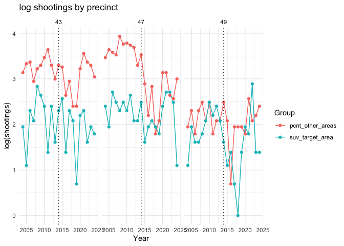
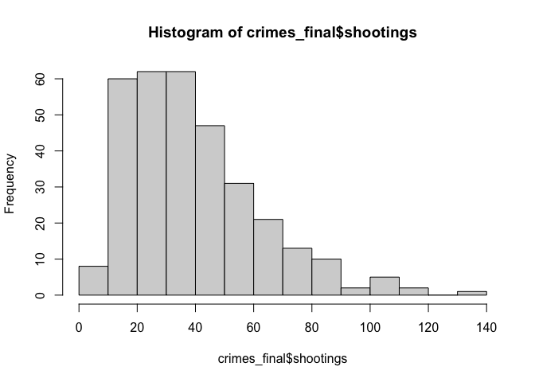
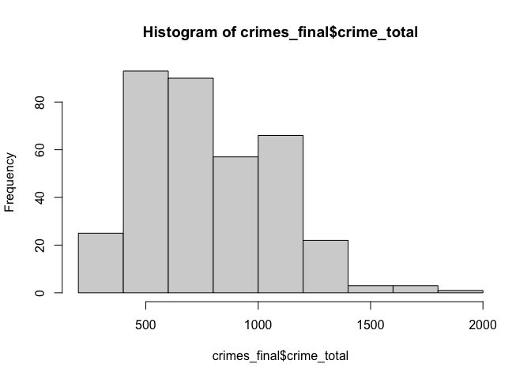
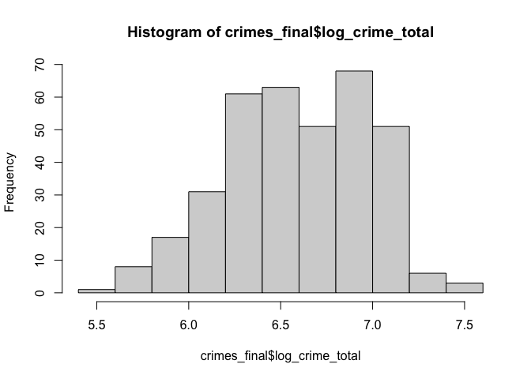
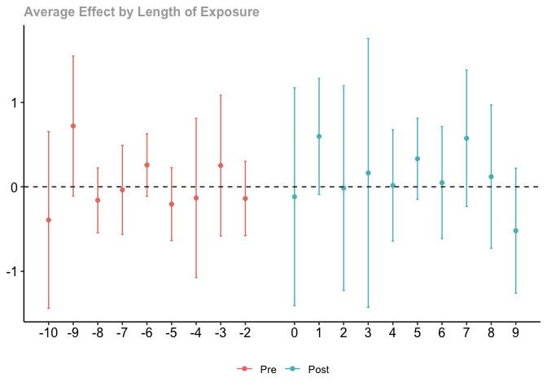
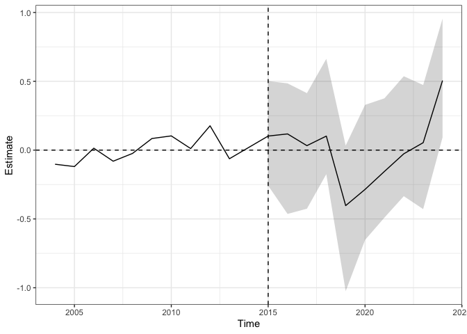
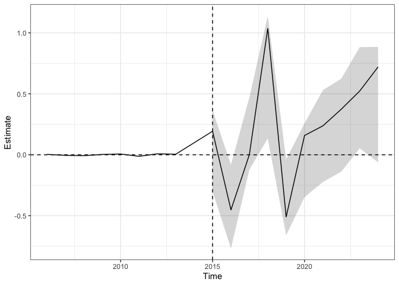

NYC Precinct Murder + Shootings + Crims Augmented Synthetic Control
Analysis
================

## Selecting Precincts:

- Cases: precincts 43, 47, 49
- Controls: chosen based on similar trends/patterns in shootings and
  murders in the pre-treatment period
  - Bronx: precincts 41, 42, 44, 52
  - Manhattan: precincts 25
  - Brooklyn: precincts 69, 70, 71, 73
  - Queens: precincts 101, 105, 113
- Excluding data in 2014 due to rollout of treatment

## Exploratory Plots

<!-- --><!-- --><!-- --><!-- --><!-- --><!-- -->

## MURDER

### Using ridge to allow for extrapolation (lambda selected through a visual analysis)

    ## 
    ## Call:
    ## single_augsynth(form = form, unit = !!enquo(unit), time = !!enquo(time), 
    ##     t_int = t_int, data = data, progfunc = "Ridge", scm = ..2, 
    ##     fixedeff = ..4, lambda = 0.2)
    ## 
    ## Average ATT Estimate:  0.010 
    ## L2 Imbalance: 0.066
    ## Percent improvement from uniform weights: 89%
    ## 
    ## Avg Estimated Bias: -0.006
    ## 
    ## Inference type: Jackknife+ over time periods
    ## 
    ##  Time Estimate 95% CI Lower Bound 95% CI Upper Bound
    ##  2015    0.101             -0.289              0.480
    ##  2016    0.151             -0.341              0.479
    ##  2017    0.027             -0.436              0.374
    ##  2018   -0.010             -0.267              0.580
    ##  2019   -0.447             -1.113             -0.104
    ##  2020   -0.290             -0.639              0.333
    ##  2021   -0.257             -0.583              0.303
    ##  2022    0.034             -0.269              0.610
    ##  2023    0.116             -0.359              0.530
    ##  2024    0.679              0.181              1.122

<!-- -->

### Not allowing for extrapolation (basic model)

    ## 
    ## Call:
    ## single_augsynth(form = form, unit = !!enquo(unit), time = !!enquo(time), 
    ##     t_int = t_int, data = data, progfunc = "None", scm = ..2, 
    ##     fixedeff = ..3)
    ## 
    ## Average ATT Estimate:  0.004 
    ## L2 Imbalance: 0.292
    ## Percent improvement from uniform weights: 51.5%
    ## 
    ## Avg Estimated Bias: NA
    ## 
    ## Inference type: Jackknife+ over time periods
    ## 
    ##  Time Estimate 95% CI Lower Bound 95% CI Upper Bound
    ##  2015    0.102             -0.258              0.502
    ##  2016    0.118             -0.464              0.485
    ##  2017    0.033             -0.426              0.414
    ##  2018    0.102             -0.175              0.663
    ##  2019   -0.403             -1.025              0.033
    ##  2020   -0.286             -0.653              0.329
    ##  2021   -0.155             -0.490              0.376
    ##  2022   -0.027             -0.335              0.537
    ##  2023    0.054             -0.429              0.473
    ##  2024    0.506              0.092              0.955

<!-- -->

## SHOOTINGS

### Using ridge to allow for extraploation (lambda selected through a visual analysis)

    ## 
    ## Call:
    ## single_augsynth(form = form, unit = !!enquo(unit), time = !!enquo(time), 
    ##     t_int = t_int, data = data, progfunc = "Ridge", scm = ..2, 
    ##     fixedeff = ..4, lambda = 0.03)
    ## 
    ## Average ATT Estimate:  0.228 
    ## L2 Imbalance: 0.020
    ## Percent improvement from uniform weights: 95%
    ## 
    ## Avg Estimated Bias: -0.010
    ## 
    ## Inference type: Jackknife+ over time periods
    ## 
    ##  Time Estimate 95% CI Lower Bound 95% CI Upper Bound
    ##  2015    0.193             -0.301              0.363
    ##  2016   -0.452             -0.768             -0.081
    ##  2017    0.001             -0.123              0.469
    ##  2018    1.035              0.133              1.139
    ##  2019   -0.510             -0.661             -0.038
    ##  2020    0.158             -0.347              0.258
    ##  2021    0.238             -0.223              0.531
    ##  2022    0.374             -0.138              0.625
    ##  2023    0.523              0.052              0.883
    ##  2024    0.721             -0.062              0.885

<!-- -->

### Not allowing for extrapolation (basic model)

    ## 
    ## Call:
    ## single_augsynth(form = form, unit = !!enquo(unit), time = !!enquo(time), 
    ##     t_int = t_int, data = data, progfunc = "None", scm = ..2, 
    ##     fixedeff = ..3)
    ## 
    ## Average ATT Estimate:  0.218 
    ## L2 Imbalance: 0.149
    ## Percent improvement from uniform weights: 62.2%
    ## 
    ## Avg Estimated Bias: NA
    ## 
    ## Inference type: Jackknife+ over time periods
    ## 
    ##  Time Estimate 95% CI Lower Bound 95% CI Upper Bound
    ##  2015    0.207             -0.330              0.373
    ##  2016   -0.570             -0.864             -0.156
    ##  2017    0.159             -0.100              0.553
    ##  2018    0.867              0.094              0.967
    ##  2019   -0.392             -0.637             -0.007
    ##  2020    0.116             -0.392              0.235
    ##  2021    0.278             -0.134              0.481
    ##  2022    0.397             -0.210              0.595
    ##  2023    0.397             -0.051              0.771
    ##  2024    0.720              0.017              0.830

<!-- -->

### CRIMES (Murder + Rape + Assault + Robbery)

### Using ridge to allow for extrapolation (lambda selected through a visual analysis)

    ## 
    ## Call:
    ## single_augsynth(form = form, unit = !!enquo(unit), time = !!enquo(time), 
    ##     t_int = t_int, data = data, progfunc = "Ridge", scm = ..2, 
    ##     fixedeff = ..4, lambda = 0.005)
    ## 
    ## Average ATT Estimate:  0.121 
    ## L2 Imbalance: 0.062
    ## Percent improvement from uniform weights: 74.1%
    ## 
    ## Avg Estimated Bias: 0.137
    ## 
    ## Inference type: Jackknife+ over time periods
    ## 
    ##  Time Estimate 95% CI Lower Bound 95% CI Upper Bound
    ##  2015    0.061             -0.274              0.319
    ##  2016    0.215             -0.033              0.421
    ##  2017    0.162             -0.037              0.459
    ##  2018    0.088             -0.073              0.468
    ##  2019    0.029             -0.109              0.450
    ##  2020    0.125             -0.083              0.439
    ##  2021    0.069             -0.081              0.478
    ##  2022    0.051             -0.201              0.574
    ##  2023    0.239             -0.185              0.721
    ##  2024    0.176             -0.173              0.584

<!-- -->

### Not allowing for extrapolation (basic model)

    ## 
    ## Call:
    ## single_augsynth(form = form, unit = !!enquo(unit), time = !!enquo(time), 
    ##     t_int = t_int, data = data, progfunc = "None", scm = ..2, 
    ##     fixedeff = ..3)
    ## 
    ## Average ATT Estimate:  0.258 
    ## L2 Imbalance: 0.106
    ## Percent improvement from uniform weights: 55.2%
    ## 
    ## Avg Estimated Bias: NA
    ## 
    ## Inference type: Jackknife+ over time periods
    ## 
    ##  Time Estimate 95% CI Lower Bound 95% CI Upper Bound
    ##  2015    0.116             -0.189              0.212
    ##  2016    0.220             -0.055              0.296
    ##  2017    0.214             -0.018              0.325
    ##  2018    0.179             -0.008              0.336
    ##  2019    0.159             -0.014              0.331
    ##  2020    0.203             -0.066              0.315
    ##  2021    0.279             -0.015              0.412
    ##  2022    0.327             -0.036              0.494
    ##  2023    0.434             -0.032              0.584
    ##  2024    0.450             -0.058              0.565

<!-- -->

## Conclusion:

- Treatments may have temporarily reduced shootings in the immediate
  period following roll-out (until 2016) but there is little evidence to
  suggest that this has had a lasting impact in reducing shootings when
  comparing to similar precincts
- There is little evidence that these treatments lowered crime compared
  to similar precincts, and in fact, there may be evidence to suggest
  that crime has increased in these 3 precincts compared to other areas
