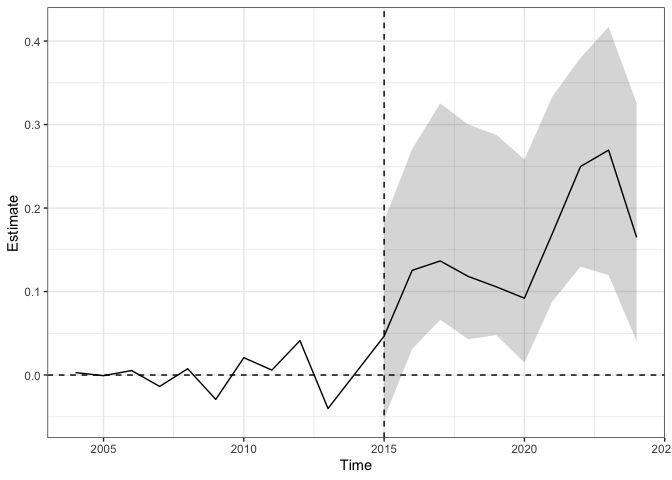

NYC Precinct Murder + Shootings + Crimes Augmented Synthetic Control
Analysis
================

## Selecting Precincts:

- Cases: precincts 43, 47, 49
- Controls: chosen based on similar trends/patterns in shootings and
  murders in the pre-treatment period
  - Bronx: precincts 40, 41, 42, 44, 46, 52
  - Manhattan: precincts 25, 32
  - Brooklyn: precincts 69, 70, 71, 73, 75
  - Queens: precincts 101, 103, 105, 113

## Exploratory Plots

## MURDER

### Using ridge to allow for extrapolation (lambda selected through a visual analysis)

    ## 
    ## Call:
    ## single_augsynth(form = form, unit = !!enquo(unit), time = !!enquo(time), 
    ##     t_int = t_int, data = data, progfunc = "Ridge", scm = ..2, 
    ##     fixedeff = ..4, lambda = 0.2)
    ## 
    ## Average ATT Estimate (p Value for Joint Null):  0.00543   ( 0.72 )
    ## L2 Imbalance: 0.038
    ## Percent improvement from uniform weights: 93.5%
    ## 
    ## Avg Estimated Bias: 0.001
    ## 
    ## Inference type: Conformal inference
    ## 
    ##  Time Estimate 95% CI Lower Bound 95% CI Upper Bound p Value
    ##  2015    0.048             -0.556              0.652   0.919
    ##  2016    0.218             -0.386              0.822   0.623
    ##  2017    0.025             -0.579              0.629   1.000
    ##  2018    0.021             -0.583              0.625   0.908
    ##  2019   -0.441             -1.045              0.163   0.470
    ##  2020   -0.365             -0.969              0.239   0.546
    ##  2021   -0.247             -0.851              0.357   0.542
    ##  2022   -0.038             -0.642              0.566   1.000
    ##  2023    0.169             -0.435              0.773   0.628
    ##  2024    0.665              0.000              1.269   0.352

<!-- -->

### Not allowing for extrapolation (basic model)

    ## 
    ## Call:
    ## single_augsynth(form = form, unit = !!enquo(unit), time = !!enquo(time), 
    ##     t_int = t_int, data = data, progfunc = "None", scm = ..2, 
    ##     fixedeff = ..3)
    ## 
    ## Average ATT Estimate (p Value for Joint Null):  0.00658   ( 0.8 )
    ## L2 Imbalance: 0.286
    ## Percent improvement from uniform weights: 51.6%
    ## 
    ## Avg Estimated Bias: NA
    ## 
    ## Inference type: Conformal inference
    ## 
    ##  Time Estimate 95% CI Lower Bound 95% CI Upper Bound p Value
    ##  2015    0.067             -0.407              0.540   0.910
    ##  2016    0.155             -0.318              0.628   0.906
    ##  2017    0.062             -0.412              0.535   0.834
    ##  2018    0.062             -0.411              0.535   0.829
    ##  2019   -0.361             -0.834              0.112   0.530
    ##  2020   -0.310             -0.783              0.164   0.831
    ##  2021   -0.132             -0.605              0.342   0.907
    ##  2022   -0.094             -0.567              0.380   0.910
    ##  2023    0.106             -0.367              0.579   0.927
    ##  2024    0.510              0.000              0.984   0.449

<!-- -->

## SHOOTINGS

### Using ridge to allow for extrapolation (lambda selected through a visual analysis)

    ## 
    ## Call:
    ## single_augsynth(form = form, unit = !!enquo(unit), time = !!enquo(time), 
    ##     t_int = t_int, data = data, progfunc = "Ridge", scm = ..2, 
    ##     fixedeff = ..4, lambda = 0.03)
    ## 
    ## Average ATT Estimate:  0.230 
    ## L2 Imbalance: 0.010
    ## Percent improvement from uniform weights: 97.2%
    ## 
    ## Avg Estimated Bias: -0.053
    ## 
    ## Inference type: Jackknife+ over time periods
    ## 
    ##  Time Estimate 95% CI Lower Bound 95% CI Upper Bound
    ##  2015    0.290             -0.464              0.415
    ##  2016   -0.510             -1.005             -0.161
    ##  2017    0.143             -0.257              0.582
    ##  2018    0.738             -0.173              1.040
    ##  2019   -0.310             -0.665              0.176
    ##  2020    0.003             -0.514              0.240
    ##  2021    0.309             -0.270              0.468
    ##  2022    0.473             -0.259              0.580
    ##  2023    0.624             -0.111              0.743
    ##  2024    0.544             -0.552              0.778

<!-- -->

### Not allowing for extrapolation (basic model)

    ## 
    ## Call:
    ## single_augsynth(form = form, unit = !!enquo(unit), time = !!enquo(time), 
    ##     t_int = t_int, data = data, progfunc = "None", scm = ..2, 
    ##     fixedeff = ..3)
    ## 
    ## Average ATT Estimate:  0.177 
    ## L2 Imbalance: 0.134
    ## Percent improvement from uniform weights: 64.1%
    ## 
    ## Avg Estimated Bias: NA
    ## 
    ## Inference type: Jackknife+ over time periods
    ## 
    ##  Time Estimate 95% CI Lower Bound 95% CI Upper Bound
    ##  2015    0.284             -0.469              0.429
    ##  2016   -0.655             -1.062             -0.171
    ##  2017    0.176             -0.247              0.593
    ##  2018    0.639             -0.180              0.905
    ##  2019   -0.256             -0.641              0.215
    ##  2020    0.014             -0.528              0.232
    ##  2021    0.233             -0.256              0.421
    ##  2022    0.396             -0.300              0.550
    ##  2023    0.444             -0.134              0.640
    ##  2024    0.497             -0.535              0.739

<!-- -->

### CRIMES (Murder + Rape + Assault + Robbery)

### Using ridge to allow for extrapolation (lambda selected through a visual analysis)

    ## 
    ## Call:
    ## single_augsynth(form = form, unit = !!enquo(unit), time = !!enquo(time), 
    ##     t_int = t_int, data = data, progfunc = "Ridge", scm = ..2, 
    ##     fixedeff = ..4, lambda = 0.005)
    ## 
    ## Average ATT Estimate:  0.105 
    ## L2 Imbalance: 0.024
    ## Percent improvement from uniform weights: 90.5%
    ## 
    ## Avg Estimated Bias: 0.042
    ## 
    ## Inference type: Jackknife+ over time periods
    ## 
    ##  Time Estimate 95% CI Lower Bound 95% CI Upper Bound
    ##  2015    0.048             -0.082              0.202
    ##  2016    0.117             -0.015              0.317
    ##  2017    0.121             -0.036              0.379
    ##  2018    0.039             -0.091              0.355
    ##  2019    0.057             -0.059              0.347
    ##  2020   -0.003             -0.082              0.291
    ##  2021    0.046              0.010              0.343
    ##  2022    0.210              0.101              0.462
    ##  2023    0.277              0.087              0.531
    ##  2024    0.144              0.020              0.418

<!-- -->

### Not allowing for extrapolation (basic model)

    ## 
    ## Call:
    ## single_augsynth(form = form, unit = !!enquo(unit), time = !!enquo(time), 
    ##     t_int = t_int, data = data, progfunc = "None", scm = ..2, 
    ##     fixedeff = ..3)
    ## 
    ## Average ATT Estimate:  0.143 
    ## L2 Imbalance: 0.070
    ## Percent improvement from uniform weights: 76.3%
    ## 
    ## Avg Estimated Bias: NA
    ## 
    ## Inference type: Jackknife+ over time periods
    ## 
    ##  Time Estimate 95% CI Lower Bound 95% CI Upper Bound
    ##  2015    0.042             -0.058              0.169
    ##  2016    0.120              0.021              0.250
    ##  2017    0.131              0.050              0.296
    ##  2018    0.113              0.027              0.268
    ##  2019    0.105              0.024              0.252
    ##  2020    0.086              0.002              0.228
    ##  2021    0.164              0.073              0.302
    ##  2022    0.249              0.119              0.371
    ##  2023    0.263              0.115              0.407
    ##  2024    0.152              0.023              0.326

<!-- -->

## Conclusion:

- Treatments may have temporarily reduced shootings in the immediate
  period following roll-out (until 2016) but there is little evidence to
  suggest that this has had a lasting impact in reducing shootings when
  comparing to similar precincts
- There is little evidence that these treatments lowered crime compared
  to similar precincts, and in fact, there may be evidnece to suggest
  that crime has increased in these 3 precincts compared to other areas
