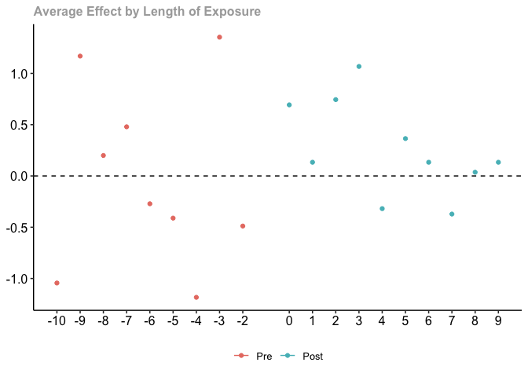
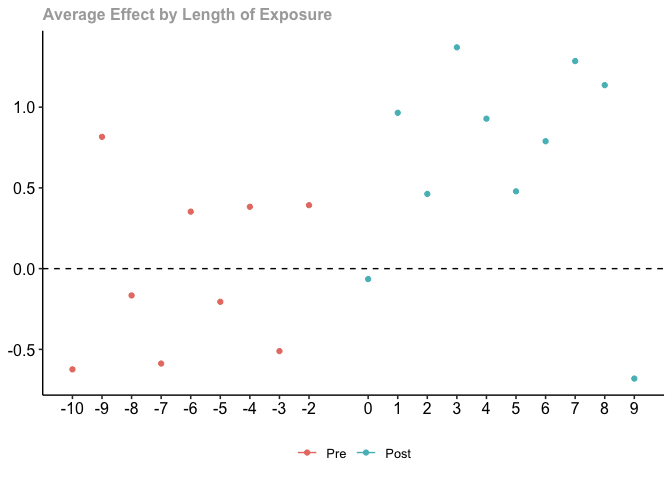
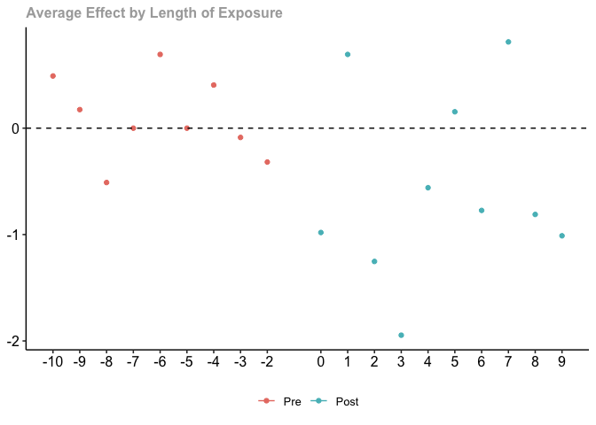

Shootings DiD by Precinct
================
2025-08-11

``` r
knitr::opts_chunk$set(warning = FALSE, message = FALSE)
knitr::opts_chunk$set(message = FALSE)

suppressPackageStartupMessages(library(tidyverse))
suppressPackageStartupMessages(library(augsynth))
suppressPackageStartupMessages(library(did))
suppressPackageStartupMessages(library(readxl))
```

``` r
crimes_final <- readRDS(here::here("data/crimes_final.rds")) |>
  filter(!is.na(case)) |>
  filter(PCT %in% c( "41", "42", "44", "48", "52", "25", "73",
                     "60", "67", "69", "70", "71", "101", "105", "113",
                     "43", "47", "49")) |> # cases
  rowwise() |>
  mutate(crime_total = sum(murder, robbery, rape, assault, na.rm = TRUE))

## Difference in Difference Analysis

dat49 <- read_excel(here::here("data/SUV vs NYPD PCNT DATA_2004_2024.xlsx"), sheet = 1) |>
  janitor::clean_names() |>
  mutate(across(everything(), ~ as.numeric(gsub("[^0-9.-]", "", .)))) |>
  mutate(PCT = 49)

dat47 <- read_excel(here::here("data/SUV vs NYPD PCNT DATA_2004_2024.xlsx"), sheet = 2) |>
  janitor::clean_names() |>
  mutate(across(everything(), ~ as.numeric(gsub("[^0-9.-]", "", .)))) |>
  mutate(PCT = 47)

dat43 <- read_excel(here::here("data/SUV vs NYPD PCNT DATA_2004_2024.xlsx"), sheet = 3) |>
  janitor::clean_names() |>
  mutate(across(everything(), ~ as.numeric(gsub("[^0-9.-]", "", .)))) |>
  mutate(PCT = 43)

merged_dat <- dat49 |>
  merge(dat47, all = TRUE) |>
  merge(dat43, all = TRUE) |>
  pivot_longer(cols = c(suv_target_area, pcnt_other_areas), 
               names_to = "group", 
               values_to = "y") |>
  mutate(log_y = log(y)) |>
  mutate(treated = ifelse(group == "suv_target_area", 1, 0)) |>
  mutate(treated_year = ifelse(treated == 1, 2015, 0)) |>
  arrange(treated, PCT, year) |>
  mutate(GROUP = as.numeric(paste0(PCT, treated)))


# for each precint, only use control and case
for (p in c("43", "47", "49"))
{
  
if (p == "43")
{
  merged_dat_new <- merged_dat |>
    filter(PCT == "43")
} else if (p == "47")
{
  merged_dat_new <- merged_dat |>
    filter(PCT == "47")
} else
{
  merged_dat_new <- merged_dat |>
    filter(PCT == "49")
}


### Removing 2014
# removing 2014
set.seed(10)
res <- att_gt(yname = "log_y",
              tname = "year",
              idname = "GROUP",
              #clustervars = c("PCT", "GROUP"),
              gname = "treated_year",
              data = merged_dat_new  |> filter(year != 2014), # remove 2014 due to rollout period
              control_group = "notyettreated" # includes both those that are never treated and those yet to be treated
)

# aggregate
print(paste0("Precinct ", p))
res_dynamic <- aggte(res, type = "dynamic")
summary(res_dynamic)
print(ggdid(res_dynamic))
}
```

    ## [1] "Precinct 43"

    ## 
    ## Call:
    ## aggte(MP = res, type = "dynamic")
    ## 
    ## Reference: Callaway, Brantly and Pedro H.C. Sant'Anna.  "Difference-in-Differences with Multiple Time Periods." Journal of Econometrics, Vol. 225, No. 2, pp. 200-230, 2021. <https://doi.org/10.1016/j.jeconom.2020.12.001>, <https://arxiv.org/abs/1803.09015> 
    ## 
    ## 
    ## Overall summary of ATT's based on event-study/dynamic aggregation:  
    ##     ATT    Std. Error     [ 95%  Conf. Int.] 
    ##  0.2617            NA         NA          NA 
    ## 
    ## 
    ## Dynamic Effects:
    ##  Event time Estimate Std. Error [95% Pointwise  Conf. Band] 
    ##         -10  -1.0440         NA              NA          NA 
    ##          -9   1.1689         NA              NA          NA 
    ##          -8   0.1997         NA              NA          NA 
    ##          -7   0.4793         NA              NA          NA 
    ##          -6  -0.2711         NA              NA          NA 
    ##          -5  -0.4111         NA              NA          NA 
    ##          -4  -1.1835         NA              NA          NA 
    ##          -3   1.3534         NA              NA          NA 
    ##          -2  -0.4884         NA              NA          NA 
    ##           0   0.6931         NA              NA          NA 
    ##           1   0.1335         NA              NA          NA 
    ##           2   0.7444         NA              NA          NA 
    ##           3   1.0678         NA              NA          NA 
    ##           4  -0.3185         NA              NA          NA 
    ##           5   0.3646         NA              NA          NA 
    ##           6   0.1335         NA              NA          NA 
    ##           7  -0.3716         NA              NA          NA 
    ##           8   0.0364         NA              NA          NA 
    ##           9   0.1335         NA              NA          NA 
    ## ---
    ## Signif. codes: `*' confidence band does not cover 0
    ## 
    ## Control Group:  Not Yet Treated,  Anticipation Periods:  0
    ## Estimation Method:  Doubly Robust

<!-- -->

    ## [1] "Precinct 47"

    ## 
    ## Call:
    ## aggte(MP = res, type = "dynamic")
    ## 
    ## Reference: Callaway, Brantly and Pedro H.C. Sant'Anna.  "Difference-in-Differences with Multiple Time Periods." Journal of Econometrics, Vol. 225, No. 2, pp. 200-230, 2021. <https://doi.org/10.1016/j.jeconom.2020.12.001>, <https://arxiv.org/abs/1803.09015> 
    ## 
    ## 
    ## Overall summary of ATT's based on event-study/dynamic aggregation:  
    ##     ATT    Std. Error     [ 95%  Conf. Int.] 
    ##  0.6671            NA         NA          NA 
    ## 
    ## 
    ## Dynamic Effects:
    ##  Event time Estimate Std. Error [95% Pointwise  Conf. Band] 
    ##         -10  -0.6238         NA              NA          NA 
    ##          -9   0.8162         NA              NA          NA 
    ##          -8  -0.1660         NA              NA          NA 
    ##          -7  -0.5878         NA              NA          NA 
    ##          -6   0.3529         NA              NA          NA 
    ##          -5  -0.2053         NA              NA          NA 
    ##          -4   0.3830         NA              NA          NA 
    ##          -3  -0.5108         NA              NA          NA 
    ##          -2   0.3930         NA              NA          NA 
    ##           0  -0.0645         NA              NA          NA 
    ##           1   0.9651         NA              NA          NA 
    ##           2   0.4626         NA              NA          NA 
    ##           3   1.3705         NA              NA          NA 
    ##           4   0.9287         NA              NA          NA 
    ##           5   0.4788         NA              NA          NA 
    ##           6   0.7890         NA              NA          NA 
    ##           7   1.2854         NA              NA          NA 
    ##           8   1.1364         NA              NA          NA 
    ##           9  -0.6807         NA              NA          NA 
    ## ---
    ## Signif. codes: `*' confidence band does not cover 0
    ## 
    ## Control Group:  Not Yet Treated,  Anticipation Periods:  0
    ## Estimation Method:  Doubly Robust

<!-- -->

    ## [1] "Precinct 49"

    ## 
    ## Call:
    ## aggte(MP = res, type = "dynamic")
    ## 
    ## Reference: Callaway, Brantly and Pedro H.C. Sant'Anna.  "Difference-in-Differences with Multiple Time Periods." Journal of Econometrics, Vol. 225, No. 2, pp. 200-230, 2021. <https://doi.org/10.1016/j.jeconom.2020.12.001>, <https://arxiv.org/abs/1803.09015> 
    ## 
    ## 
    ## Overall summary of ATT's based on event-study/dynamic aggregation:  
    ##      ATT    Std. Error     [ 95%  Conf. Int.] 
    ##  -0.5677            NA         NA          NA 
    ## 
    ## 
    ## Dynamic Effects:
    ##  Event time Estimate Std. Error [95% Pointwise  Conf. Band] 
    ##         -10   0.4906         NA              NA          NA 
    ##          -9   0.1744         NA              NA          NA 
    ##          -8  -0.5108         NA              NA          NA 
    ##          -7   0.0000         NA              NA          NA 
    ##          -6   0.6931         NA              NA          NA 
    ##          -5   0.0000         NA              NA          NA 
    ##          -4   0.4055         NA              NA          NA 
    ##          -3  -0.0870         NA              NA          NA 
    ##          -2  -0.3185         NA              NA          NA 
    ##           0  -0.9808         NA              NA          NA 
    ##           1   0.6931         NA              NA          NA 
    ##           2  -1.2528         NA              NA          NA 
    ##           3  -1.9459         NA              NA          NA 
    ##           4  -0.5596         NA              NA          NA 
    ##           5   0.1542         NA              NA          NA 
    ##           6  -0.7732         NA              NA          NA 
    ##           7   0.8109         NA              NA          NA 
    ##           8  -0.8109         NA              NA          NA 
    ##           9  -1.0116         NA              NA          NA 
    ## ---
    ## Signif. codes: `*' confidence band does not cover 0
    ## 
    ## Control Group:  Not Yet Treated,  Anticipation Periods:  0
    ## Estimation Method:  Doubly Robust

<!-- -->
